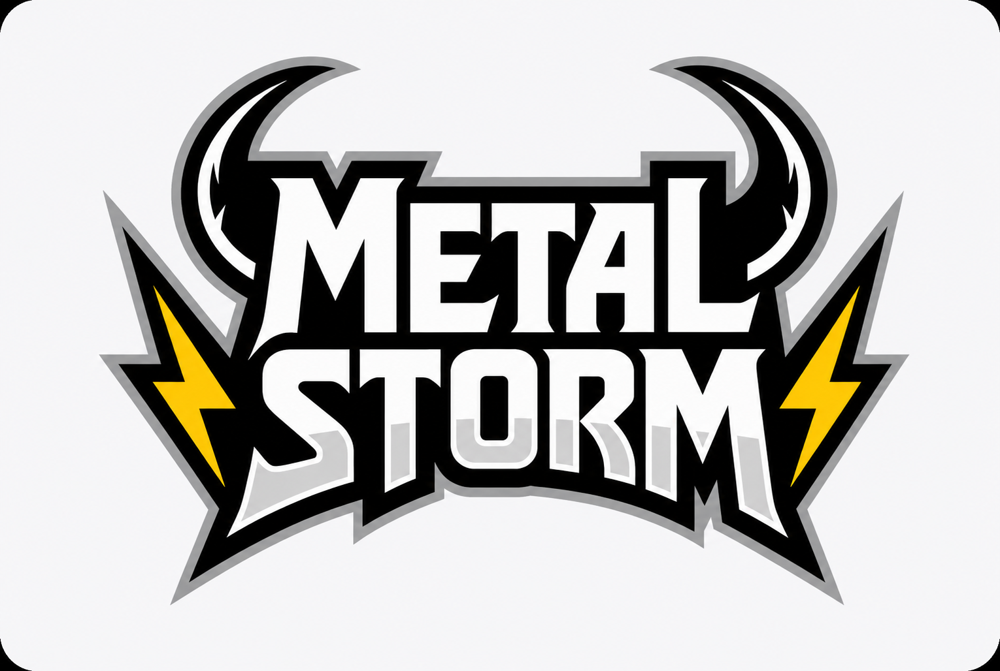

# rockhub_3Bgrupo

<h3 align="center"><i>Não necessariamente é de rock</i></h3>

## Aqui em __METAL STORM__ você -
### Aprende e escuta desde clássicos do rock ao metal pesado, saber o passado de cada composição garanto que irá deixar a sua vida mais daora, ouça e *sinta-se bem*, pois é onde sobre bandas que o seu mundo se transforma. 

## Catálogo de bandas e suas melhores músicas:

- Imagine Dragons;
  > Bones, Enemy, Eyes Closed, Natural, Believe, Radioctive, warriors.
- Blur;
  > Song 2, Bugman, Death of Party, Stereotypes, Parklife, Coffee & TV, Beetlebum, Tender, Country House, The Universal, For Tomorrow, Charmless Man.
- Linkin Park;
  > In the End, Faint, QWERTY, One Stap Closed, Lost, Wesside, Heavy Is the Crown, Massive, Numb.
- Metalica
  > Master of Puppets, Lepper Massiah, Damage,Inc, Orion, The Thing That Should Not be, Enter Sandman.
- Nirvana;
  > Smells like Teen Spirit, Rape Me, Very Ape, Pennyroyal Tea, Tourett's, Sappy, School, Sliver, Frances Farmer Will Have Her Revenge on Seattle, In Bloom, Territorial Pissings.
- Gorillaz;
  > Feel Good Inc, Cracker Sland, Clint Eastwood, New Gold, Rhinestone eyes, DARE, Stylo, Kids in Guns, Tranz, 19-2000, Last Living Souls.
- AC/DC;
  > Back in Black, T.N.T, Thunderstrack, Highwey to Hell, Hells Bells, You Shook Me All Night Long, Touch too Much.
- Led Zeppelin.
  > Immigrant Song, Rock and Roll, When The Levee Breaks, Stairway to Heaven, Kashmir, Black Dog, Achilles Last Stand, The Rover, Heartbreaker, Nobody's Fault but Mine, In My Time of Dying.
- guns n' roses;
  > Sweet Child O' Mine, Paradise City, You Could Be Mine, Welcome To The Jungle, Nightrain, It's So Easy, Out Ta Get Me, My Michelle, Garden of Eden, Perfect Crime, Back Off Bitch, Shotgun Blues, Bad Obsession, Locomotive.
- Slipknot.
  > Wait and Bleed, Duality, Spit It Out, People = Shit, Disasterpiece, The Heretic Anthem, Psychosocial, The Devil in I, Unsainted, Before I Forget, Left Behind, Custer, Snuff.

## Cada banda terá a sua:
- História contada;
- Informações importantes como integrantes e outra coisas;
- Shows que marcaram suas histórias;
- Curiosidades;
- Quiz relacionado a cada banda;
- Melhores músicas de cada e instrumentais das mesmas.

## Há quem usaria este site/app
### O Metal Storm foi desenvolvido para fãs de rock e metal, músicos experientes ou iniciantes e para qualquer pessoa que goste de explorar a cultura musical. Também é uma ótima opção para quem deseja descobrir novas bandas, testar seus conhecimentos e aprender mais sobre diferentes artistas e estilos musicais.

# Evento Internacionais:
### Seria uma espécie de agenda para cada banda (*colocaremos quando der*).
